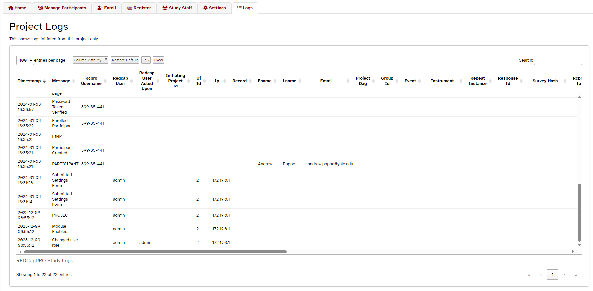
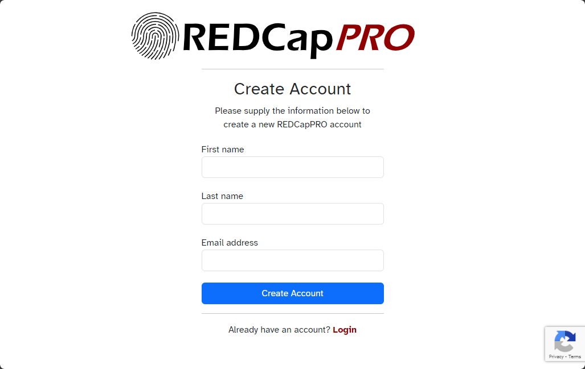
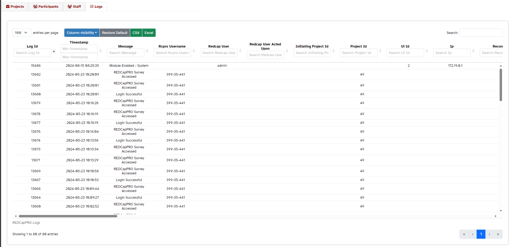

# REDCapPRO - Patient Reported Outcomes

    

## Table of Contents <!-- omit in toc -->
- [REDCapPRO - Patient Reported Outcomes](#redcappro---patient-reported-outcomes)
  - [Overview](#overview)
    - [What is REDCapPRO?](#what-is-redcappro)
    - [How does it work?](#how-does-it-work)
    - [What is the process like for participants?](#what-is-the-process-like-for-participants)
  - [Installation](#installation)
  - [EM Settings](#em-settings)
    - [System Settings](#system-settings)
    - [Project Settings](#project-settings)
    - [Custom Header Logo](#custom-header-logo)
    - [Translation / Multi-Language Management](#translation--multi-language-management)
      - [Built-In Languages](#built-in-languages)
      - [Custom System Languages](#custom-system-languages)
      - [Project Language Manager](#project-language-manager)
      - [Participant Language Selection](#participant-language-selection)
      - [Language Resolution Order](#language-resolution-order)
  - [REDCapPRO Project Menu](#redcappro-project-menu)
    - [Home Tab](#home-tab)
    - [Manage Participants](#manage-participants)
    - [Enroll](#enroll)
    - [Register](#register)
    - [Study Staff](#study-staff)
    - [Settings](#settings)
    - [Logs](#logs)
  - [Self-Registration](#self-registration)
  - [REDCapPRO Control Center Menu](#redcappro-control-center-menu)
    - [Projects](#projects)
    - [Participants](#participants)
    - [Staff](#staff)
    - [Logs](#logs-1)
  - [API](#api)
    - [Register Participants](#register-participants)
    - [Enroll Participants](#enroll-participants)
  - [Action Tags](#action-tags)
  - [Changelog](#changelog)

## Overview

### What is REDCapPRO?
**REDCapPRO** is an external module for [REDCap](https://projectredcap.org) that allows participants/patients to directly report study data (*i.e.*, ePRO). Its primary purpose is to allow the identification of a survey participant and to log that information in a REDCap project's audit trail in a manner compliant with regulatory stipulations (primarily FDA's 21 CFR Part 11). The reason this is needed is that there is no built-in REDCap feature that provides all of the following:
1. **Identification**: It identifies the survey respondent (via a participant ID) in the logs of the project itself. 
2. **Authentication**: It provides a means of proving that the participant is genuinely who they claim to be. There is no way for another person to pretend to be the participant, either in real time or after the fact by modifying logs. Obvious exceptions:

    1. Malicious attacks outside of **REDCapPRO** (*e.g.*, intercepting a participant's password reset email by hacking their email account) 
    2. REDCap admin or other IT professional directly modifying the database

3. **Authorization**: It provides a means of preventing unauthorized users from viewing identifying information and taking other unauthorized actions.
4. **Convenience**: It must be easy to use for REDCap admins, REDCap users, and study participants.

To achieve this, project users must first register a participant with **REDCapPRO** and then enroll that participant in the REDCap project. Step-by-step instructions are provided below.

**REDCapPRO** is not meant to replace any of the following features/modules/external modules:
- Survey Login
- Participant Identifier
- REDCap Mobile App
- [MyCap](https://projectmycap.org/)
- REDCap Survey Auth

### How does it work?
**REDCapPRO** provides a means for study participants to log in to REDCap surveys using a username created by **REDCapPRO** and a password that they choose for themselves. This password is not known to any other person (including study staff and REDCap admins). 

<u>These are the steps required to collect data using **REDCapPRO**:</u>

1. Enable the module in the REDCap system
2. Enable the module in a REDCap project
3. **Register:** A staff member of the study registers a participant with **REDCapPRO**
   * The participant is registered system-wide. They use the same username and password for all REDCapPRO surveys in this REDCap system regardless of which REDCap project the survey belongs to.
   * *Note: as of REDCapPRO 2.1.0, the option exists for participants to register themselves. See the [Self-Registration](#self-registration) section below for more information.*
4. **Enroll:** The study staff member then enrolls the participant in this particular REDCap project
   * *Note: as of REDCapPRO 2.1.0, the option exists for participants to enroll themselves. See the [Self-Registration](#self-registration) section below for more information.*
5. Survey invitations can then be sent to the participant using REDCap survey distribution tools like normal. Participants will be required to **log in** with their **REDCapPRO** username (or email address) and password to access the survey. Because the login credentials are not tied to a specific record, public surveys are compatible with **REDCapPRO**.

### What is the process like for participants?

* Upon registration with **REDCapPRO**, the participant will receive an email with a
link to set their password.
* When the participant clicks a link to start a survey in a **REDCapPRO** project, they will see a login screen and will need to supply their username and password.
* They have the option to be sent a password reset email, a username reminder email, and/or an email address reminder email from the login screen.

* If multifactor authentication is enabled in the project, they will also be required to provide a security token after successfully logging in with their username and password. This token can either be sent to their email address or generated by an authenticator app like Google Authenticator or Microsoft Authenticator.

*If authenticator apps are enabled for MFA, users will have a choice of MFA method*

*If email is chosen as the MFA method, users will receive an email with a security code*

*If an authenticator app is chosen for the MFA method, users will be prompted to enter a code from their authenticator app*

## Installation
* This External Module should be installed via the REDCapREPO
* It may also be installed by unpacking the code into the modules directory on your REDCap web server.

## EM Settings
These are settings/configuration options accessible in the normal External Module settings interface.

### System Settings

| Setting                                                                            |   Type   | Description                                                                                                                                                                                                                                            |     Default Value     |
| :--------------------------------------------------------------------------------- | :------: | :----------------------------------------------------------------------------------------------------------------------------------------------------------------------------------------------------------------------------------------------------- | :-------------------: |
| **Language File**                                                                  | Dropdown | The language that participant-facing text in the module will appear in. This system setting can be overridden by the corresponding project setting. See the [Translation / Multi-Language Management](#translation--multi-language-management) section below for more information.                            |        English        |
| **Email From Address**                                                             |  Email   | This will be the From email address for all system emails. This can help if emails are being sent to spam or are not delivered.                                                                                                                        | noreply@REDCapPRO.com |
| **Prevent Email Login**                                                            | Checkbox | Should participants be prevented from using their email address to log in to the system. Checking this will require that they login using their participant username only. *Note: if checked, this overrides the associated project-level setting.* |       Unchecked       |
| **Warning Time**                                                                   |  Number  | Number of minutes to wait before warning participant of inactivity timeout                                                                                                                                                                             |       1 minute        |
| **Timeout Time**                                                                   |  Number  | Number of minutes to wait before logging participant out due to inactivity                                                                                                                                                                             |       5 minutes       |
| **Allow Project-Level Timeout Time Override**                                      | Checkbox | Allow a project-level timeout time to be defined and override system timeout time setting                                                                                                                                                              |       Unchecked       |
| **Password Length**                                                                | Integer  | Minimum length of participant's password in characters                                                                                                                                                                                                 |     8 characters      |
| **Login Attempts**                                                                 | Integer  | Number of consecutive failed login attempts before being locked out                                                                                                                                                                                    |      3 attempts       |
| **Lockout Duration**                                                               | Integer  | Length of a lockout due to failed login attempts, in seconds                                                                                                                                                                                           |      300 seconds      |
| **Multi-Factor Authentication**                                                    | Checkbox | Require participants to use multi-factor authentication when logging in. This requires participants to enter a code sent to their email address in addition to their password.                                                                         |       Unchecked       |
| **Multi-Factor Authentication with Authenticator App**                             | Checkbox | Allow participants to use an authenticator app (like Google Authenticator or Microsoft Authenticator) to generate a security code for multi-factor authentication. If unchecked, participants will only be able to receive a security code via email.  |       Unchecked       |
| **Restrict Multi-Factor Authentication project settings to REDCap administrators** | Checkbox | If checked, only REDCap administrators will be able to access the multi-factor authentication settings in the project. If unchecked, any REDCapPRO manager will be able to access the multi-factor authentication settings.                            |       Unchecked       |
| **Allow Self-Registration**                                                        | Checkbox | Allow participants to [register themselves](#self-registration) with **REDCapPRO**. If checked, a link will appear on the login page that will take the participant to a registration page.                                                            |       Unchecked       |
| **Restrict Self-Registration project settings to REDCap administrators**           | Checkbox | If checked, only REDCap administrators will be able to access the self-registration settings in the project. If unchecked, any REDCapPRO manager will be able to access the self-registration settings.                                                |       Unchecked       |
| **Allow Auto-Enroll Upon Self-Registration**                                       | Checkbox | Allow participants to enroll themselves in a project when they register. If checked, the participant will be automatically enrolled in the REDCapPRO project when they self-register                                                                   |       Unchecked       |
| **reCaptcha Site Key**                                                             |   Text   | The site key for the reCaptcha v3 service. This is used to prevent bots from registering. *Note: You **cannot** use the same site key as the one utilized by REDCap on surveys, because that site key is a v2 key.*                                    |        (blank)        |
| **reCaptcha Secret Key**                                                           |   Text   | The secret key for the reCaptcha v3 service. This is used to prevent bots from registering. *Note: You **cannot** use the same secret key as the one utilized by REDCap on surveys, because that secret key is a v2 key.*                              |        (blank)        |
| **System Header Logo Image**                                                       |   File   | Upload an image file to use as the default logo on all participant-facing pages. Accepted formats: JPG, PNG, GIF, SVG, WebP. Maximum size: 2 MB.                                                                                                       |        (blank)        |
| **Use System Logo**                                                                | Checkbox | Display the uploaded system logo on participant-facing pages. Uncheck to revert to the original default REDCapPRO logo without removing the uploaded file. Only shown when a system logo file has been uploaded.                                       |       Unchecked       |
| **Allow Custom Project Logos**                                                     | Checkbox | Allow project administrators to upload a custom logo that appears in participant-facing page headers. If disabled, all projects display the system logo (or the original default if no system logo is set). See [Custom Header Logo](#custom-header-logo). |       Unchecked       |
| **Enable the API**                                                                 | Checkbox | Enable the API for this system. This allows you to register and enroll participants using the [API](#api).                                                                                                                                             |       Unchecked       |
| **Restrict API project settings to REDCap administrators**                         | Checkbox | If checked, only REDCap administrators will be able to access the API settings in the project. If unchecked, any REDCapPRO manager will be able to access the API settings.                                                                            |       Unchecked       |

### Project Settings

Project configuration is done within the project's **REDCapPRO** menu. 

### Custom Header Logo

**REDCapPRO** supports custom branding by allowing a logo image to be displayed in the header of all participant-facing pages (login, password reset, etc.). The logo is resolved in the following priority order:

1. **Project logo** — if the system permits custom project logos and the project has uploaded one, it is shown.
2. **System logo** — if a system-level logo has been uploaded and enabled, it is used as the default across all projects.
3. **Default** — the original REDCapPRO logo (`RCPro_Logo_Alternate.svg`) is shown.

Custom logos are only shown on **participant-facing pages**. Project staff pages always display the standard REDCapPRO logo.

**System-level configuration** (Control Center → External Modules → REDCapPRO):
- Upload a logo file with **System Header Logo Image**.
- Toggle it on/off with **Use System Logo** without deleting the file.
- Grant projects the ability to override it with **Allow Custom Project Logos**.

**Project-level configuration** (REDCapPRO Project Menu → Settings):
- Upload a per-project logo with **Header Logo** (only visible when **Allow Custom Project Logos** is enabled at the system level).
- Remove the custom logo by checking the *Remove custom logo and restore the default* checkbox and saving.

### Translation / Multi-Language Management

**REDCapPRO** has full multi-language support across every page of the module — participant-facing pages, project staff pages, and the Control Center. All text is driven by `.ini` translation files and can be customized at both the system and project level. Participants can switch languages on the fly from any participant-facing page, and their choice persists across sessions.

#### Built-In Languages

The following languages ship with the module as built-in `.ini` files located in the [lang](lang) directory:

| Language |
| -------- |
| English  |
| Deutsch (German) |
| Español (Spanish) |
| Français (French) |
| Chinese  |

The default language for all pages is configured with the **Language File** system setting (Control Center → External Modules → REDCapPRO). This can be overridden at the project level via the **Language** dropdown in the REDCapPRO Project Menu → Settings tab.

If the language you need is not in the list, feel free to create an `.ini` file and open a pull request, or send the file to `andrew dot poppe at yale dot edu`.

#### Custom System Languages

REDCap administrators can add additional languages beyond the built-in set directly from the External Module system settings using the **Add Language** repeatable sub-setting:

| Field | Description |
| :---- | :---------- |
| **Language Code** | A unique name/identifier for this language (e.g. `Italian`). This is what appears in language dropdowns. |
| **Language File** | Upload a `.ini` translation file in the same format as the built-in files in the [lang](lang) directory. |
| **Language Direction** | Text direction — `ltr` (left-to-right) or `rtl` (right-to-left). |
| **Active** | Whether this language is available for selection. |

Custom system languages act as built-in languages and are available in all projects.

#### Project Language Manager

Within the REDCapPRO Project Menu → Settings tab, managers and administrators have access to a full **Language Manager** that goes far beyond simply picking a default language:

- **Activate / Deactivate built-in languages** — Choose which of the built-in (and custom system) languages are offered to participants in this project. Only active languages appear in the participant language selector.
- **Add a custom project language** — Add a brand-new language that exists only within this project using one of two methods:
  - **Import from file** — Upload a `.ini` or `.json` translation file. A downloadable English template is provided in both formats to use as a starting point.
  - **Manual entry** — Use the built-in string editor, which presents every English string alongside an editable field for the translated value. A text direction (`ltr` or `rtl`) can be set for each custom language.
- **Copy a language** — Duplicate any existing language (built-in or custom) as a new custom project language, then edit it from there.
- **Edit existing custom translations** — Reopen the string editor for any custom project language to update individual strings.
- **Download language files** — Export any language (built-in or custom) in either **JSON** or **INI** format. This is useful for sharing translations or using them as a starting point for another language.
- **Delete custom project languages** — Remove a custom project language and its stored strings. Built-in languages cannot be deleted (only deactivated).

> **Note:** Only managers and REDCap administrators can access the Language Manager. Built-in languages can be deactivated but not edited or deleted through the UI.

#### Participant Language Selection

On all participant-facing pages, a **language selector** is displayed so participants can switch to any language that has been activated for the project. Their selection persists across sessions.

#### Language Resolution Order

When rendering a page, **REDCapPRO** resolves text strings in the following layered order (later layers override earlier ones):

1. **English built-in** — The ultimate fallback; guarantees every string has a value.
2. **System default language** — The language configured in the system settings (`Language File`).
3. **Project default language** — The language selected in the project's Settings tab.
4. **Participant's selected language** — The language most recently chosen by the participant via the on-page language selector.

This layered approach means that a custom translation only needs to define the strings it cares about — any untranslated strings gracefully fall back through the chain.

## REDCapPRO Project Menu

The **REDCapPRO** Project Menu is accessible via a link in the Applications section of the REDCap project side menu. Access to the different sections of the menu is restricted based on the `role` of the user (see the Study Staff tab description for details). The link to the menu itself is only visible to users or role `Monitor` or above, although the Home tab is accessible by anyone. 

### Home Tab

This is an informational page.
This tab is accessible by any role (including no access).

### Manage Participants

This tab allows a user to view enrolled participants in this study project and to 
take various actions on study participants. The actions available
and the information that is visible depends on the `role` of the user. The tab
itself is available to Monitors and above.

| Label             |  Type  | Description                                                                                                                                                                                                | Minimum Role to view/use |
| ----------------- | :----: | ---------------------------------------------------------------------------------------------------------------------------------------------------------------------------------------------------------- | :----------------------: |
| Username          | Column | Contains the **REDCapPRO** username assigned to this participant                                                                                                                                           |        *Monitor*         |
| First Name        | Column | Contains the first name of this participant                                                                                                                                                                |    <u>Normal User</u>    |
| Last Name         | Column | Contains the last name of this participant                                                                                                                                                                 |    <u>Normal User</u>    |
| Email             | Column | Contains the email address of this participant                                                                                                                                                             |    <u>Normal User</u>    |
| Data Access Group | Column | Contains the DAG the participant is currently in *Note that this is independent of which DAG a REDCap record that corresponds with this participant might be assigned to*                                  |        *Monitor*         |
| Data Access Group | Action | Ability to reassign DAG. The user must not be assigned to a DAG in order to reassign DAGs, much like changing a record's DAG in REDCap. (Prior to version 1.0.0, DAGs in **REDCapPRO** worked differently) |    <u>Normal User</u>    |
| Reset Password    | Action | Sends an email to the participant which contains a password reset link                                                                                                                                     |        *Monitor*         |
| Change Name       | Action | Updates the name in the **REDCapPRO** database for this participant                                                                                                                                        |    <u>**Manager**</u>    |
| Change Email      | Action | Updates the email address in the **REDCapPRO** database for this participant                                                                                                                               |    <u>**Manager**</u>    |
| Disenroll         | Action | Removes the participant from this study project                                                                                                                                                            |    <u>Normal User</u>    |

### Enroll

This tab allows a user to search for a registered participant in order to enroll them into this study project. Users can
set the participant's Data Access Group at this time as well, if applicable. This tab is available to Normal Users and 
above.

You can enroll many participants at once by importing a CSV file. The file must be formatted with the following columns. *Note: the participants must already be registered with **REDCapPRO** before they can be enrolled in a project.*

| Column name  | Description                                      | Possible values                                            | Required | Notes                                                                                                                                                                                                                                                                                                                                      |
| ------------ | ------------------------------------------------ | ---------------------------------------------------------- | -------- | ------------------------------------------------------------------------------------------------------------------------------------------------------------------------------------------------------------------------------------------------------------------------------------------------------------------------------------------ |
| **username** | REDCapPRO username of the participant            | Any text                                                   | Required | Either this column or the `email` column must be present in the import file. **NOT BOTH**                                                                                                                                                                                                                                                  |
| **email**    | Email address of the participant                 | Valid email                                                | Required | Either this column or the `username` column must be present in the import file. **NOT BOTH**                                                                                                                                                                                                                                               |
| **dag**      | Data Access Group to enroll the participant into | Integer value representing the Data Access Group ID number | Optional | This value can be found on the DAGs page in the project.  The usual DAG rules apply, so you can only assign a participant to a DAG if that DAG exists in the project. If you are assigned to a DAG yourself, you can only assign participants to that DAG. If you are not assigned to a DAG, you can assign the participant to any DAG. |

You can also register (and optionally enroll) many participants at once by importing a CSV file on the [Register](#Register) tab.

### Register

This tab allows a user to register a participant with **REDCapPRO**. Users also have the option to enroll at the same 
time as registering. They can set the participant's Data Access Group at this time as well, if applicable.  This tab is 
available to Normal Users and above.

You can also register (and optionally enroll) many participants at once by importing a CSV file. The file must be formatted with the following columns.

| Column name | Description                                                                       | Possible values                                            | Required | Notes                                                                                                                                                                                                                                                                                                                                                                                                                   |
| ----------- | --------------------------------------------------------------------------------- | ---------------------------------------------------------- | -------- | ----------------------------------------------------------------------------------------------------------------------------------------------------------------------------------------------------------------------------------------------------------------------------------------------------------------------------------------------------------------------------------------------------------------------- |
| **fname**   | First name of the participant                                                     | Any text                                                   | Required |                                                                                                                                                                                                                                                                                                                                                                                                                         |
| **lname**   | Last name of the participant                                                      | Any text                                                   | Required |                                                                                                                                                                                                                                                                                                                                                                                                                         |
| **email**   | Email address of the participant                                                  | Valid email                                                | Required | The email address must not match the email address of a registered participant. If so, you will receive an error message and the import will be cancelled.                                                                                                                                                                                                                                                              |
| **enroll**  | Whether or not to enroll the participant into this study once they are registered | `Y` to enroll   `<Blank>` not to enroll                 | Optional | You can omit the column entirely if you do not want to enroll any of the newly registered participants.                                                                                                                                                                                                                                                                                                                 |
| **dag**     | Data Access Group to enroll the participant into                                  | Integer value representing the Data Access Group ID number | Optional | This value can be found on the DAGs page in the project. If enroll is not "Y" for a row, then the DAG value is ignored for that row.   The usual DAG rules apply, so you can only assign a participant to a DAG if that DAG exists in the project. If you are assigned to a DAG yourself, you can only assign participants to that DAG. If you are not assigned to a DAG, you can assign the participant to any DAG. |

*Note: The column names are case-sensitive. The order of the columns does not matter.*

*Note: If you are using Excel to create the CSV file, you will need to save the file as a CSV file in order for REDCap to recognize it as such.*

### Study Staff

This tab allows Managers to set the `role` of users in the study project. All
REDCap users are shown in this table. Set the role of the user according to this
guide:
| Role        | Description                                                                                                                               |
| ----------- | ----------------------------------------------------------------------------------------------------------------------------------------- |
| No Access   | No access to **REDCapPRO** is given to this user.                                                                                         |
| Monitor     | Basic access. Can only view usernames and dags and can only initiate password resets.                                                     |
| Normal User | Able to view participant identifying information and take several participant management actions (see Manage Participants section above). |
| Manager     | Highest permissions. Has the ability to grant/revoke staff access and change a participant's email address                                |

*<u>Note</u>: REDCap administrators have full Manager permissions in **REDCapPRO** no matter what `role` they have in the project (or if they appear in the staff list at all)*

### Settings

This tab contains some project-level configuration options. This tab is only 
accessible by managers.
| Setting                                                             |       Type       | Description                                                                                                                                                                                                                                                                |            Default Value             |
| :------------------------------------------------------------------ | :--------------: | :------------------------------------------------------------------------------------------------------------------------------------------------------------------------------------------------------------------------------------------------------------------------- | :----------------------------------: |
| **Language**                                                        |     Dropdown     | The language that participant-facing text in the module will appear in. This overrides the default system setting. See the [Translation / Multi-Language Management](#translation--multi-language-management) section for more information.                                                                                       |               English                |
| **Prevent Email Login**                                             |     Checkbox     | If checked, this prevents participants from using their email address to log in to surveys. Instead, they must use their REDCapPRO username to log in.  *If email logins are prevented at the system level, this setting will not appear in the project setttings tab.* |              Unchecked               |
| **Timeout Time**                                                    | Positive Integer | Number of minutes to wait before logging participant out due to inactivity. This overrides the default system setting, but it is only shown if enabled at the system level.                                                                                                | (blank) - defaults to system setting |
| **Multifactor Authentication**                                      |     Checkbox     | Require participants to use multi-factor authentication when logging in. This requires participants to enter a code sent to their email address in addition to their password.                                                                                             |              Unchecked               |
| **Allow MFA Authenticator App**                                     |     Checkbox     | Allow participants to use an authenticator app (like Google Authenticator or Microsoft Authenticator) to generate a security code for multi-factor authentication. If unchecked, participants will only be able to receive a security code via email.                      |              Unchecked               |
| **API**                                                             |     Checkbox     | Enable the API for this project. This allows you to register and enroll participants using the [API](#api).                                                                                                                                                                |              Unchecked               |
| **Allow Self-Registration**                                         |     Checkbox     | Allow participants to [register themselves](#self-registration) with **REDCapPRO**. If checked, a link will appear on the login page that will take the participant to a registration page.                                                                                |              Unchecked               |
| **Auto-Enroll Upon Self-Registration**                              |     Checkbox     | Participants will be automatically enrolled in this project when they self-register.                                                                                                                                                                                       |              Unchecked               |
| **Email address to notify when new participants are auto-enrolled** |      Email       | If auto-enroll is enabled, this email address will be notified when a participant self-registers and is auto-enrolled.                                                                                                                                                     |               (blank)                |
| **Study Contact Name**                                              |       Text       | The name of the study staff member that study participants should contact with questions/problems. This will appear in emails sent to the participant                                                                                                                      |                 N/A                  |
| **Study Contact Email**                                             |      Email       | Email address that participants should contact.                                                                                                                                                                                                                            |                 N/A                  |
| **Study Contact Phone**                                             |      Phone       | Phone number that participants should contact.                                                                                                                                                                                                                             |                 N/A                  |
### Logs

This tab allows Managers to view and export the logs of **REDCapPRO** relevant to this study
project. It only contains information about actions taken in this project, on
surveys tied to this project, or certain actions taken regarding participants enrolled in this project. This tab is only accessible by Managers.

## Self-Registration

As of REDCapPRO v2.1.0, the option exists to allow participants to register themselves with **REDCapPRO**. This is done by enabling the `Allow Self-Registration` option in both the [system configuration](#system-settings) and in the [project settings](#settings). When this option is enabled, a **"Don't have an account? Create one"** link will appear on the login page that will take the participant to a registration page.

## REDCapPRO Control Center Menu

This menu is accessible via a link in the External Modules section of the
Control Center. Being in the Control Center, it is only accessible to REDCap
administrators. It has the following sections:

### Projects

This table shows all of the REDCap projects that currently have **REDCapPRO**
enabled and some basic information about them.

### Participants

This table lists all registered participants in the system. It lists every study
project that each participant is enrolled in. It allows the following actions to
be taken on a participant:

| Action                        | Description                                                                                                                                                                    |
| ----------------------------- | ------------------------------------------------------------------------------------------------------------------------------------------------------------------------------ |
| Reset Password                | Sends an email to the participant which contains a password reset link                                                                                                         |
| Update Name                   | Updates the name in the **REDCapPRO** database for this participant                                                                                                            |
| Change Email                  | Updates the email address in the **REDCapPRO** database for this participant                                                                                                   |
| Reactivate/Deactivate Account | A deactivated participant is unable to be enrolled in additional projects. However, they are still able to interact normally with projects to which they are already enrolled. |

### Staff

This table lists all REDCap users that have a `role` above No Access in any 
**REDCapPRO** study project. It lists all projects that each user has access to with
a `role` of Monitor or above.

### Logs

Similar to the project's Logs tab, this lists all logs made by **REDCapPRO** across
the system.

## API

This module provides an API for interacting with **REDCapPRO**. Using this API is similar to using the REDCap API. You must make a POST request to the API URL (The API URL is found on the project settings page.) The data must contain these three keys:

1. **token**: The REDCap API token
2. **action**: The action you want to perform (either `register` or `enroll`, see below)
3. **data**: A JSON encoded array of participants. Details about the format of the data are described below. 
   
### Register Participants
This method allows you to register participants with **REDCapPRO**. 

* **token**: The REDCap API token
* **action**: `register`
* **data**: A JSON string which represents an array of participant objects. The `data` array can contain any number of participants. Each participant object must have the following:
  
| Field name | Description                                                                       | Possible values                                            | Required | Notes                                                                                                                                                                                                                                                                                                                                                                                                              |
| ---------- | --------------------------------------------------------------------------------- | ---------------------------------------------------------- | -------- | ------------------------------------------------------------------------------------------------------------------------------------------------------------------------------------------------------------------------------------------------------------------------------------------------------------------------------------------------------------------------------------------------------------------ |
| **fname**  | First name of the participant                                                     | Any text                                                   | Required |                                                                                                                                                                                                                                                                                                                                                                                                                    |
| **lname**  | Last name of the participant                                                      | Any text                                                   | Required |                                                                                                                                                                                                                                                                                                                                                                                                                    |
| **email**  | Email address of the participant                                                  | Valid email                                                | Required | The email address must not match the email address of a registered participant. If so, you will receive an error message and the import will be cancelled.                                                                                                                                                                                                                                                         |
| **enroll** | Whether or not to enroll the participant into this study once they are registered | `Y` to enroll   Omit to not enroll                      | Optional |                                                                                                                                                                                                                                                                                                                                                                                                                    |
| **dag**    | Data Access Group to enroll the participant into                                  | Integer value representing the Data Access Group ID number | Optional | This value can be found on the DAGs page in the project. If enroll is not "Y" for a participant, then the DAG value is ignored.   The usual DAG rules apply, so you can only assign a participant to a DAG if that DAG exists in the project. If you are assigned to a DAG yourself, you can only assign participants to that DAG. If you are not assigned to a DAG, you can assign the participant to any DAG. |

*Note: The field names are case-sensitive. The order of the fields does not matter.*

### Enroll Participants

This method allows you to enroll already-registered participants into a **REDCapPRO** project. 

* **token**: The REDCap API token
* **action**: `enroll`
* **data**: A JSON string which represents an array of participant objects. The `data` array can contain any number of participants. Each participant object must have the following:
  

| Field name   | Description                                      | Possible values                                            | Required | Notes                                                                                                                                                                                                                                                                                                                                       |
| ------------ | ------------------------------------------------ | ---------------------------------------------------------- | -------- | ------------------------------------------------------------------------------------------------------------------------------------------------------------------------------------------------------------------------------------------------------------------------------------------------------------------------------------------- |
| **username** | REDCapPRO username of the participant            | Any text                                                   | Required | Either this field or the `email` field must be present in the import file. **NOT BOTH**                                                                                                                                                                                                                                                     |
| **email**    | Email address of the participant                 | Valid email                                                | Required | Either this field or the `username` field must be present in the import file. **NOT BOTH**                                                                                                                                                                                                                                                  |
| **dag**      | Data Access Group to enroll the participant into | Integer value representing the Data Access Group ID number | Optional | This value can be found on the DAGs page in the project.   The usual DAG rules apply, so you can only assign a participant to a DAG if that DAG exists in the project. If you are assigned to a DAG yourself, you can only assign participants to that DAG. If you are not assigned to a DAG, you can assign the participant to any DAG. |

## Action Tags

This module provides several action tags for populating REDCap fields with 
information about **REDCapPRO** participants. These are described below:
*Note: All action tags must exist on the same data collection instrument (not survey).*

| Action Tag      | Use with field type | Validation on field type | Description                                                                                                                                                          |
| --------------- | :-----------------: | :----------------------: | -------------------------------------------------------------------------------------------------------------------------------------------------------------------- |
| @RCPRO-USERNAME |        text         |           none           | This transforms the field into a dropdown selector. The user can select a participant and populate the field with that participant's username                        |
| @RCPRO-EMAIL    |        text         |          email           | If @RCPRO-USERNAME is present on the instrument, then when it is selected the field with the @RCPRO-EMAIL tag will be populated with the participant's email address |
| @RCPRO-FNAME    |        text         |           none           | Like @RCPRO-EMAIL, but the field will be populated with the participant's first name                                                                                 |
| @RCPRO-LNAME    |        text         |           none           | Likewise, with last name                                                                                                                                             |

## Changelog

See the [Release Notes](https://github.com/AndrewPoppe/REDCap-PRO/releases) for a complete list of changes.
